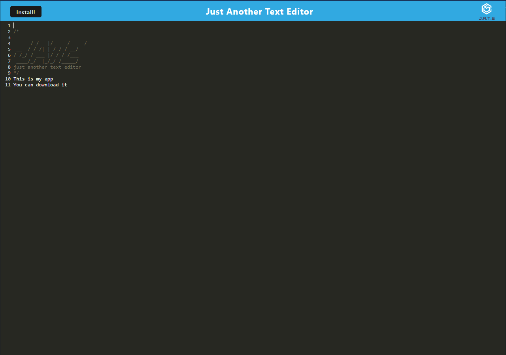

# pwa-text-editor

## Links
-Live Site: https://pwa-text-editor.herokuapp.com/

-repo: https://github.com/waustin45/pwa-text-editor.git

github: https://github.com/waustin45

## Description

I build this app to be used as a text editor and to have the ability to work with the program offline as a pwa.

## User Story
```
As a coder 
I want to be able to write my code into a text editor
Once I have written my code
I want to have my code stay persistent.
```

## Preview


